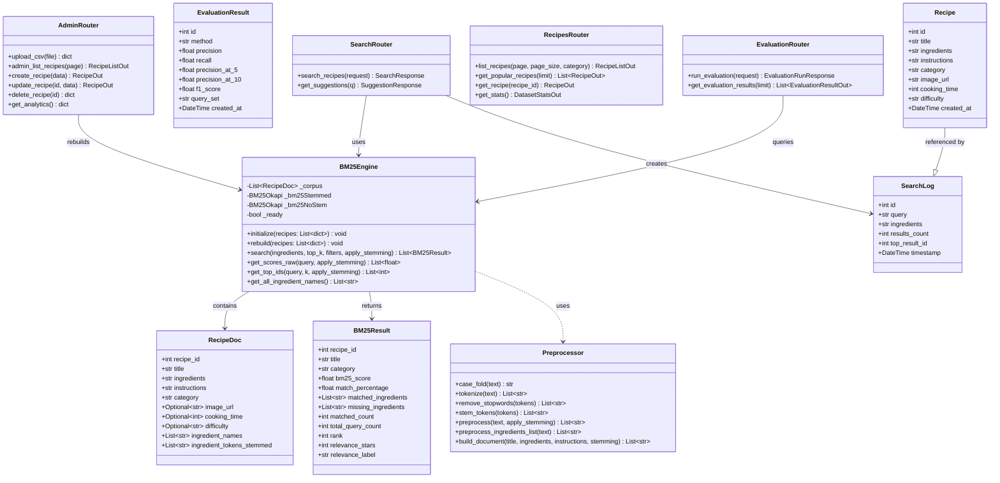
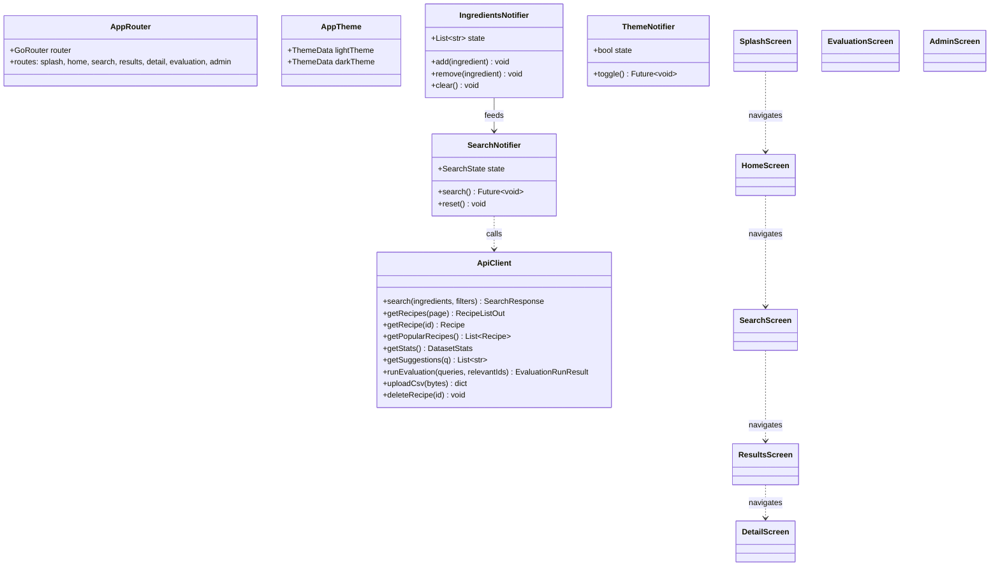
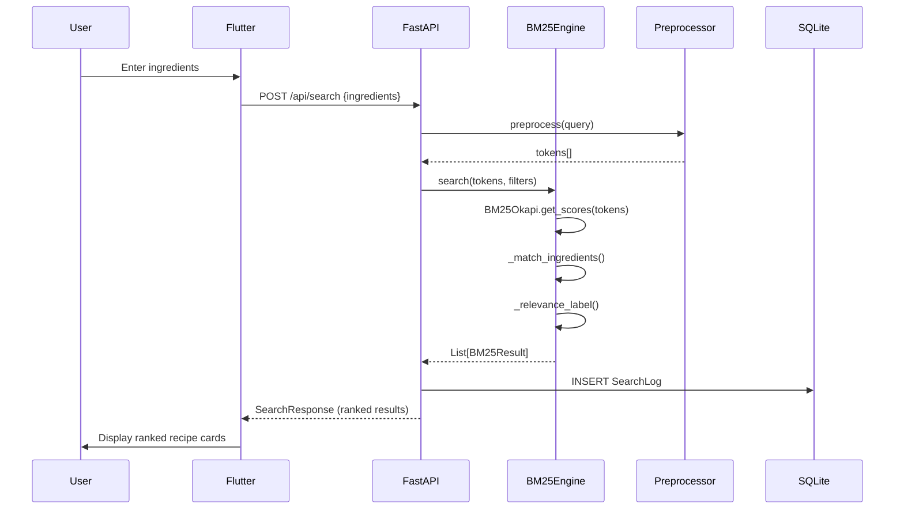

# UML Class Diagram — Smart Recipe Planner

## Backend Architecture

```mermaid
classDiagram
    class BM25Engine {
        -List~RecipeDoc~ _corpus
        -BM25Okapi _bm25Stemmed
        -BM25Okapi _bm25NoStem
        -bool _ready
        +initialize(recipes: List~dict~) void
        +rebuild(recipes: List~dict~) void
        +search(ingredients, top_k, filters, apply_stemming) List~BM25Result~
        +get_scores_raw(query, apply_stemming) List~float~
        +get_top_ids(query, k, apply_stemming) List~int~
        +get_all_ingredient_names() List~str~
    }

    class RecipeDoc {
        +int recipe_id
        +str title
        +str ingredients
        +str instructions
        +str category
        +Optional~str~ image_url
        +Optional~int~ cooking_time
        +Optional~str~ difficulty
        +List~str~ ingredient_names
        +List~str~ ingredient_tokens_stemmed
    }

    class BM25Result {
        +int recipe_id
        +str title
        +str category
        +float bm25_score
        +float match_percentage
        +List~str~ matched_ingredients
        +List~str~ missing_ingredients
        +int matched_count
        +int total_query_count
        +int rank
        +int relevance_stars
        +str relevance_label
    }

    class Preprocessor {
        +case_fold(text) str
        +tokenize(text) List~str~
        +remove_stopwords(tokens) List~str~
        +stem_tokens(tokens) List~str~
        +preprocess(text, apply_stemming) List~str~
        +preprocess_ingredients_list(text) List~str~
        +build_document(title, ingredients, instructions, stemming) List~str~
    }

    class Recipe {
        +int id
        +str title
        +str ingredients
        +str instructions
        +str category
        +str image_url
        +int cooking_time
        +str difficulty
        +DateTime created_at
    }

    class SearchLog {
        +int id
        +str query
        +str ingredients
        +int results_count
        +int top_result_id
        +DateTime timestamp
    }

    class EvaluationResult {
        +int id
        +str method
        +float precision
        +float recall
        +float precision_at_5
        +float precision_at_10
        +float f1_score
        +str query_set
        +DateTime created_at
    }

    class SearchRouter {
        +search_recipes(request) SearchResponse
        +get_suggestions(q) SuggestionResponse
    }

    class RecipesRouter {
        +list_recipes(page, page_size, category) RecipeListOut
        +get_popular_recipes(limit) List~RecipeOut~
        +get_recipe(recipe_id) RecipeOut
        +get_stats() DatasetStatsOut
    }

    class AdminRouter {
        +upload_csv(file) dict
        +admin_list_recipes(page) RecipeListOut
        +create_recipe(data) RecipeOut
        +update_recipe(id, data) RecipeOut
        +delete_recipe(id) dict
        +get_analytics() dict
    }

    class EvaluationRouter {
        +run_evaluation(request) EvaluationRunResponse
        +get_evaluation_results(limit) List~EvaluationResultOut~
    }

    BM25Engine --> RecipeDoc : contains
    BM25Engine --> BM25Result : returns
    BM25Engine ..> Preprocessor : uses
    SearchRouter --> BM25Engine : uses
    SearchRouter --> SearchLog : creates
    AdminRouter --> BM25Engine : rebuilds
    EvaluationRouter --> BM25Engine : queries
    Recipe --|> SearchLog : referenced by
```

## Flutter Frontend Architecture

```mermaid
classDiagram
    class AppRouter {
        +GoRouter router
        +routes: splash, home, search, results, detail, evaluation, admin
    }

    class AppTheme {
        +ThemeData lightTheme
        +ThemeData darkTheme
    }

    class ApiClient {
        +search(ingredients, filters) SearchResponse
        +getRecipes(page) RecipeListOut
        +getRecipe(id) Recipe
        +getPopularRecipes() List~Recipe~
        +getStats() DatasetStats
        +getSuggestions(q) List~str~
        +runEvaluation(queries, relevantIds) EvaluationRunResult
        +uploadCsv(bytes) dict
        +deleteRecipe(id) void
    }

    class IngredientsNotifier {
        +List~str~ state
        +add(ingredient) void
        +remove(ingredient) void
        +clear() void
    }

    class SearchNotifier {
        +SearchState state
        +search() Future~void~
        +reset() void
    }

    class ThemeNotifier {
        +bool state
        +toggle() Future~void~
    }

    class SplashScreen
    class HomeScreen
    class SearchScreen
    class ResultsScreen
    class DetailScreen
    class EvaluationScreen
    class AdminScreen

    SplashScreen ..> HomeScreen : navigates
    HomeScreen ..> SearchScreen : navigates
    SearchScreen ..> ResultsScreen : navigates
    ResultsScreen ..> DetailScreen : navigates
    SearchNotifier ..> ApiClient : calls
    IngredientsNotifier --> SearchNotifier : feeds
```

## BM25 Search Flow

```mermaid
sequenceDiagram
    participant User
    participant Flutter
    participant FastAPI
    participant BM25Engine
    participant Preprocessor
    participant SQLite

    User->>Flutter: Enter ingredients
    Flutter->>FastAPI: POST /api/search {ingredients}
    FastAPI->>Preprocessor: preprocess(query)
    Preprocessor-->>FastAPI: tokens[]
    FastAPI->>BM25Engine: search(tokens, filters)
    BM25Engine->>BM25Engine: BM25Okapi.get_scores(tokens)
    BM25Engine->>BM25Engine: _match_ingredients()
    BM25Engine->>BM25Engine: _relevance_label()
    BM25Engine-->>FastAPI: List[BM25Result]
    FastAPI->>SQLite: INSERT SearchLog
    FastAPI-->>Flutter: SearchResponse (ranked results)
    Flutter->>User: Display ranked recipe cards
```
